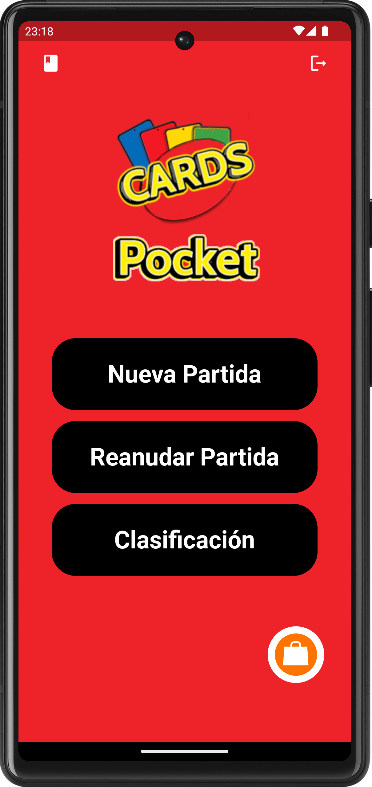
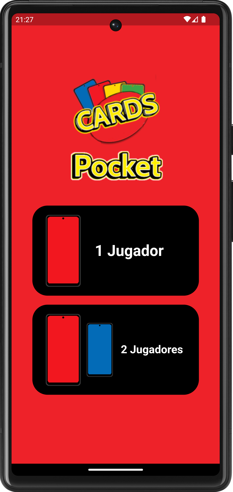
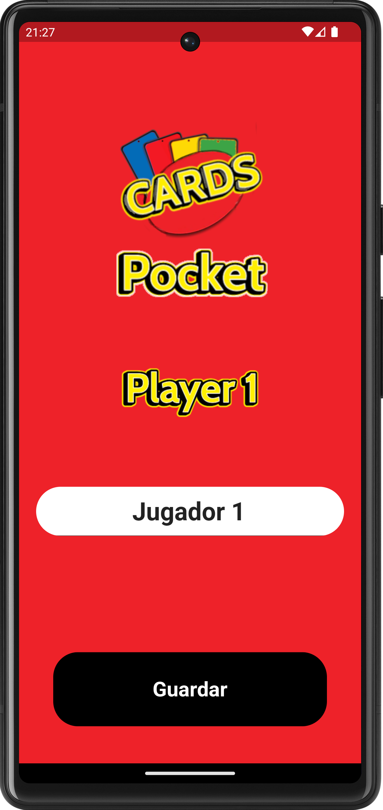
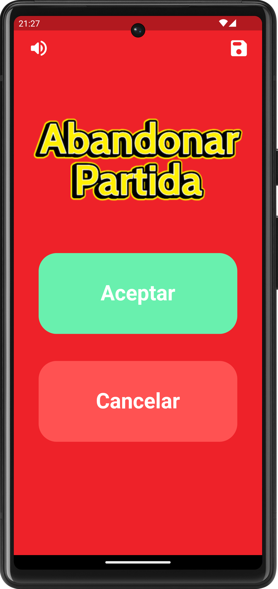
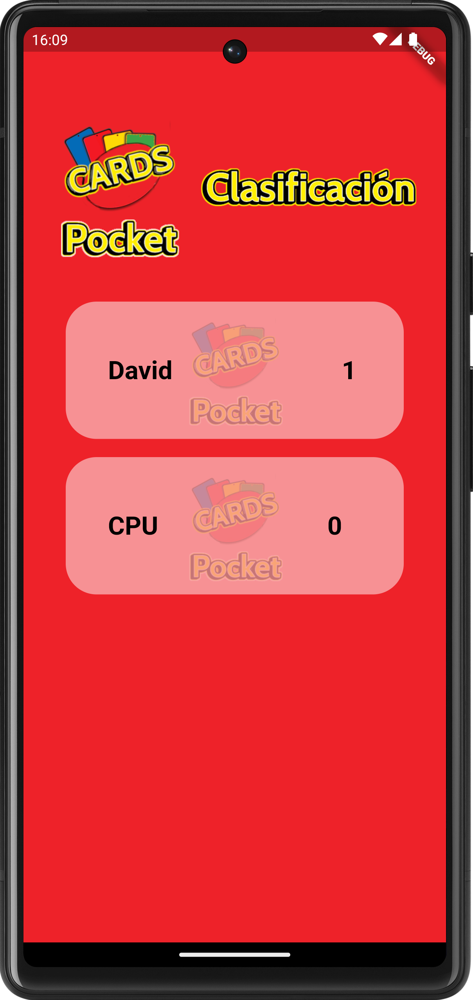

# UNO Pocket
Juego de cartas multiplataforma escrito en Flutter

# Compatibilidad
- [x] android
- [x] iOS
- [x] macOS 
- [x] Windows
- [x] Linux

# Dependencias
Las dependencias de software libre que hacen que este proyecto sea posible
```
  stacked: ^3.2.0
  audioplayers: ^3.0.1
  flutter_launcher_icons: ^0.12.0
  sqflite: ^2.2.6
  quiver: ^3.2.1
  path_provider: ^2.0.14
```

# Capturas de pantalla
Capturas de las principales pantallas de la aplicación

## Pantalla de inicio
Muestra el menu principal junto a varias opciones, entre ellas : 
``` Nueva Partida```
``` Clasificación```
``` Reglas ```


<br/>

## Pantalla de jugadores
Elige modo de juego, contra la CPU o modo dos jugadores


<br/>

## Pantalla de nombre
Elige el nombre de los jugadores 


<br/>

## Tablero de juego
Donde ocurre toda la acción de la aplicación.
Cuenta con opciones de silenciar audio y guardar progreso


<br/>

## Menu de pausa
Permite pausar el juego así como salir del mismo


<br/>

## Pantalla de victoria
Muestra el ganador actual y permite volver a incio o volver a jugar una revancha


<br/>

## Pantalla de clasificación
Muestra un listado con los ganadores y estadísticas de los mismos



<br/>


